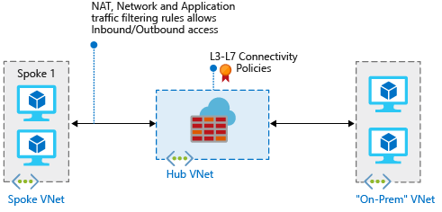

# Private AKS Development Network

This is an example Azure based AKS development network. It is based on two tutorials on the main Microsoft site:

* https://docs.microsoft.com/en-us/azure/firewall/tutorial-hybrid-ps
* https://docs.microsoft.com/en-us/azure/aks/learn/quick-kubernetes-deploy-powershell

## Build the network

The "Build Basic Network" script is mostly a stripped down version of the [tutorial-hybrid-ps](https://docs.microsoft.com/en-us/azure/firewall/tutorial-hybrid-ps) tutorial. When completed, it produces a network like this:

## Add an AKS spoke.

The second script will add a new AKS Cluster and peer this "spoke" network with the firewall hub network.

> Important note: There are some manual steps in this script that involve obtaining GUIDs/IDs of created resources to update lines of code - sorry for that :(
> So don't just run the script and expect it to work.
> This will be changed in the future to automate the process.

